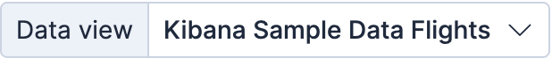
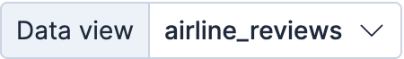
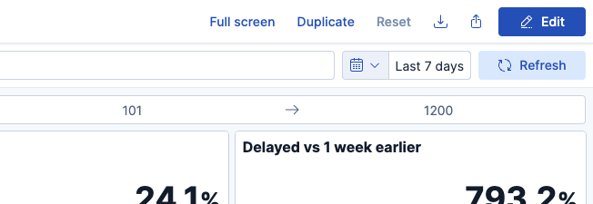
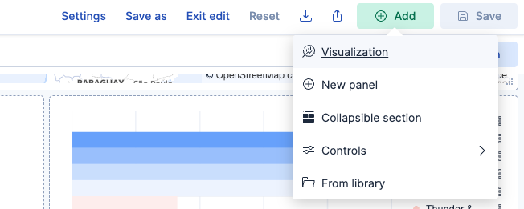
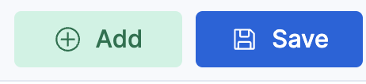
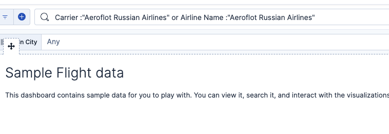
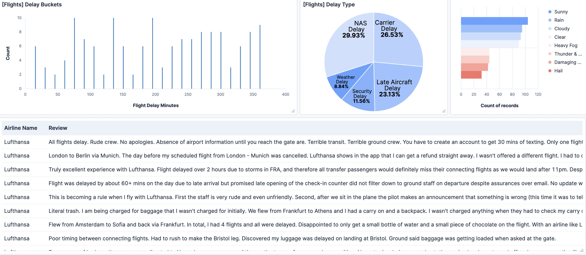

What you will do during this challenge
===
Before diving into how giving your LLM proper tool to navigate the course of your enterprise data, you will :
1. Take a tour on the workshop's dataset
2. Create views to graphically surface information and help customer choose the best airline for their next trip

Take a tour on the workshop's dataset
===
Let's have a look to the use case's [button label="Dataset"](tab-0).
Data has been ingested for you in two separated indices:
-  gathering flights facts like airports, travel conditions and delays
-  gathering the airlines user's comments and rating of their flight experience

Create Airline review dashboard
===
1. Let's switch to [button label="dashboards list "](tab-1)
2. click on the Flights dashboard
3. Click the edit button
4. Click on Add button and select >New Panel > ES|QL 
5. Copy and paste the below ES|QL query in the configuration form. Click Run Query > Apply and Close
```
FROM airline_reviews
| KEEP `Airline Name`, Review
```
5.  Save the dashboard


Filter stats and reviews to focus on specific airline
===
Copy and paste the below KQL query in the search bar and Click Update

```
Carrier :"Lufthansa" or Airline Name :"Lufthansa"
```
What you have done during this challenge
===
You now have a combined view with Airline delay stats and customer review to decide if Lufthansa is a good company for your next trip !


> [!NOTE]
>Not really easy to dig into this amount of information right?
>During the next challenge, you will use the summarization power of LLM with agent builder to chat with your data in natural language and get those insights instantly!


