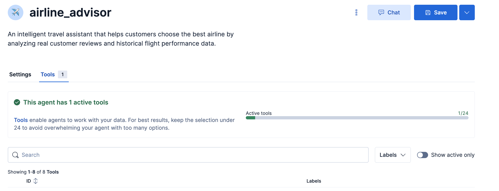
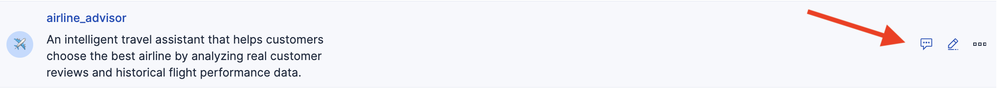
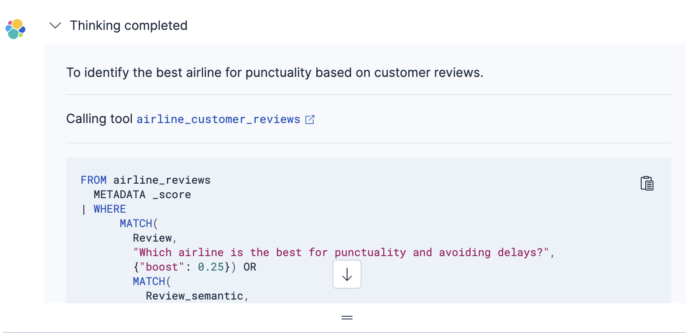

What you will do during this challenge
===
Now that you know the dataset you have to work with, you will
1. Create a tool to be able to get the most relevant customer reviews regarding a customer question
2. Assign this tool to the airline advisor agent. He will use it to enrich his context
3. Chat with him about airline advices

Create customer reviews analysis tool
===
1. Click on the Manage tools button 
2. Add a new tool 

 Use the following  Parameters

[button label="Tool ID"]()
```
airline_customer_reviews
```

[button label="Description"]()
```
A semantic search query to retrieve any relevant information un customer reviews
```

[button label="ES|QL Query"]()
```
FROM airline_reviews METADATA _score
    | WHERE MATCH(Review  , ?question, { "boost": 0.25 }) OR  MATCH(Review_semantic, ?question, { "boost": 0.75 })
    | SORT _score DESC
    | limit 50
```
 Click on infer parameter to automagically populate the list of parameters with **?question** and define it as follows


Click Save


Click on Agent builder on top left to come back to main menu


Assign customer reviews analysis tool to airline advisor agent
===
1. Click on the Manage agents button 
2. Edit airline_advisor agent by clicking the pen button appearing near the three dots when you hover it
3. In tools tab check the airline_customer_reviews tool

4. You should now have a total of 1 tool assigned to the agent

6. Click Save

Chat with airline advisor agent
===
1. Click chat button near the three dots on the airline_advisor agent line when you hover it

2. Ask the following question to the agent
```
	I don't want to be late,  what is the best company?
```
The agent will answer you based on the customer reviews

You can check his reasoning process and the tools he used by dropping down the arrow at the beginning of the answer

> [!WARNING]
> Content shown is generated dynamically and may differ across interactions.

What you have done during this challenge
===
Congratulations, you built an agent that has direct access to airline customers opinion. He can guide future customer in their airline choice based on past customers experience.
> [!NOTE]
> But Truth lives in the numbers! Let's confirm customer reviews with some statistics to get more accurate answer in the next challenge!