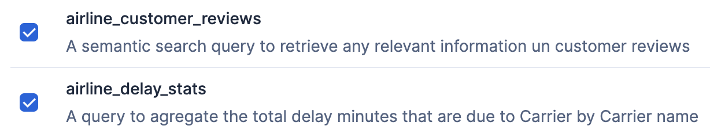
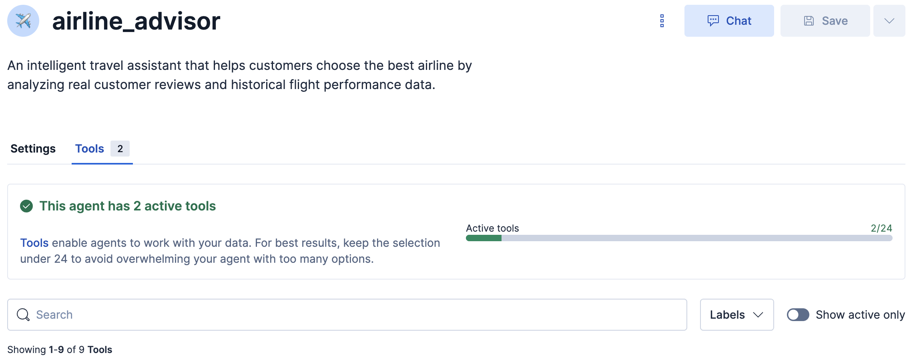
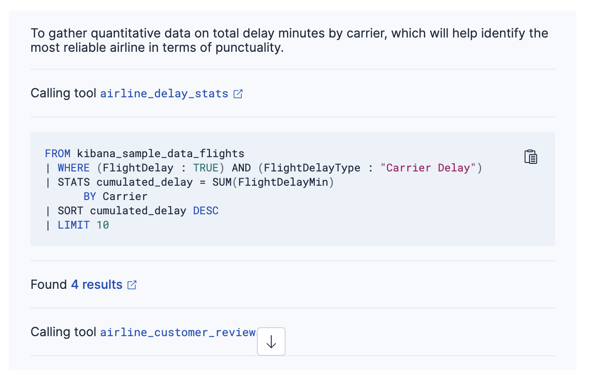

What you will do during this challenge
===
You will upgrade your customer experience by releasing a new version of your agent :
1. Creating a tool to get delay statistics out of flight history dataset
2. Assigning this tool to the airline advisor agent. He will use it to enrich his context and confirm customer reviews he already has access to
3. Chat with him about airline advices

Create airline delays analysis tool
===
1. Click on the Manage tools button 
2. Add a new tool 

 Use the following  Parameters

[button label="Tool ID"]()
```
airline_delay_stats
```

[button label="Description"]()
```
A query to agregate the total delay minutes that are due to Carrier by Carrier name
```

[button label="ES|QL Query"]()
```
FROM kibana_sample_data_flights
		| where FlightDelay : true  and FlightDelayType: "Carrier Delay"
		| STATS  cumulated_delay = SUM(FlightDelayMin) by Carrier
		| SORT cumulated_delay DESC
		| limit 10
```
Click Save

Click on Agent builder on top left to come back to main menu


Assign airline delay statistics tool to airline advisor agent
===
1. Click on the Manage agents button 
2. Edit airline_advisor agent by clicking the pen button appearing near the three dots when you hover it 
3. In tools tab check the airline_delay_stats tool

4. You should now have a total of 1 tool assigned to the agent

6. Click Save

Chat with airline advisor agent
===
Click chat button near the three dots on the airline_advisor agent line when you hover it

Ask the following question to the agent
```
	I don't want to be late,  what is the best company?
```
The agent will answer you based on the customer reviews and airline real past performance (check it by dropping down the reasoning section)

> [!WARNING]
> Content shown is generated dynamically and may differ across interactions.

What you have done during this challenge
===
Congratulations, you built an agent that has direct access to airline customers opinion and flight stats. He can guide future customer in their airline choice based on past customers experience and real data.
> [!NOTE]
> Great!  But carrier are not operating the same way in each airport, and it can affect user experience.  In the next challenge you'll learn how to narrow down statistics to the domestic airport of the user!