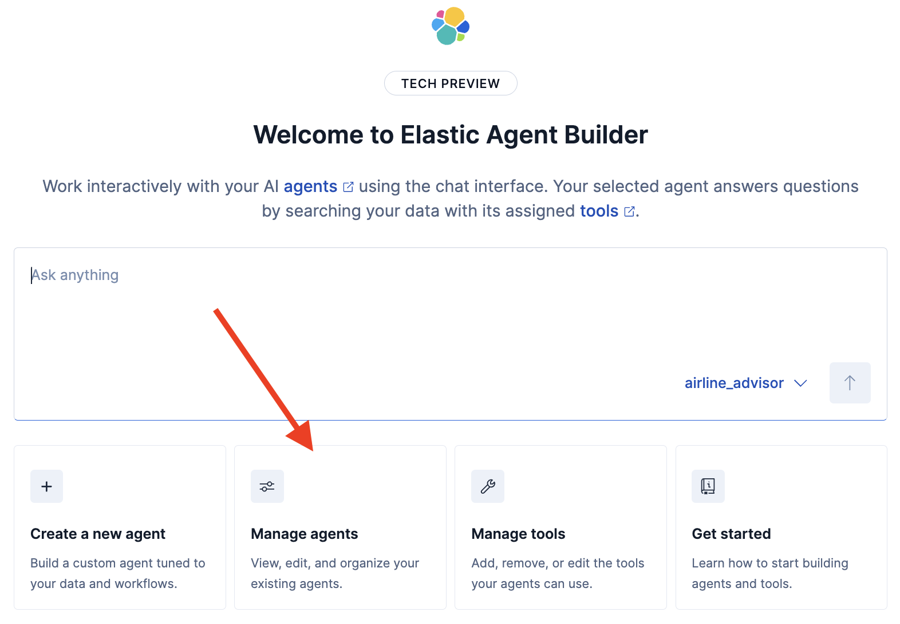
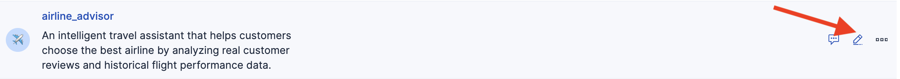
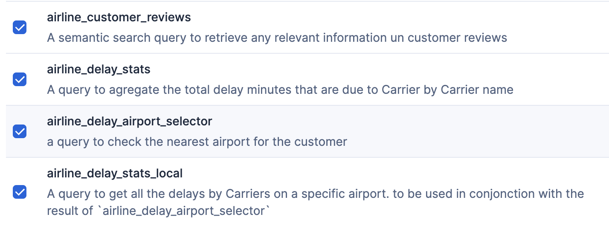
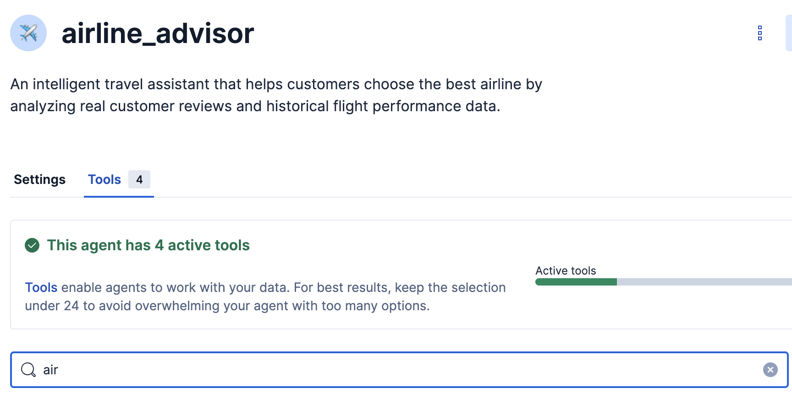
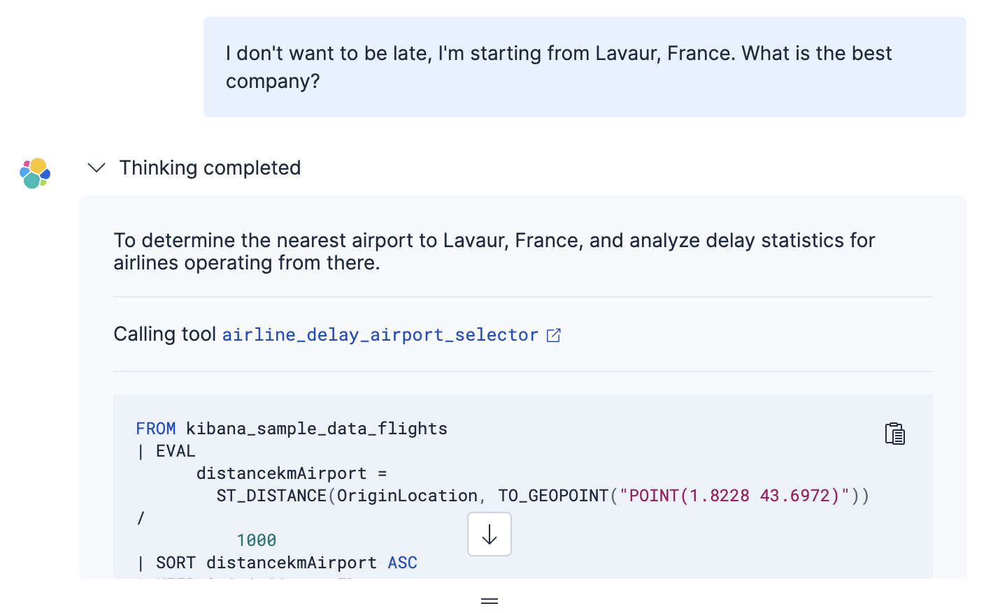

What you will do during this challenge
===
You will upgrade your customer experience by releasing a new version of your agent :
1. Creating a tool  able to get the customer domestic's airport of the flight history dataset based on the customer location
2. Creating a tool to get the delay statistics out of flight history dataset, filtered regarding the customer's domestic airport
3. Assigning these tools to the airline advisor agent. He will use it to enrich his context and confirm customer reviews he already has access to
4. Chat with him about airline advices

Create airline_delay_airport_selector tool
===
1. Click on the Manage tools button 
2. Add a new tool 

 Use the following  Parameters

[button label="Tool ID"]()
```
airline_delay_airport_selector
```

[button label="Description"]()
```
a query to check the nearest airport for the customer
```

[button label="ES|QL Query"]()
```
FROM kibana_sample_data_flights
		| EVAL distancekmAirport = ST_DISTANCE(OriginLocation , TO_GEOPOINT(?coordinate))/1000
		| SORT distancekmAirport ASC
		| KEEP OriginAirportID
		| limit 1
```

Click on infer parameter to automagically populate the list of parameters with **?coordinates** and define it as follows
[button label="description"]()
```
the coordinates in the WKT format ie POINT(`longitude` `latitude`)
```

[button label="type"]()
```
text
```
Click Save

Create airline_delay_stats_local tool
===
1. Add a new tool 

 Use the following  Parameters

[button label="Tool ID"]()
```
airline_delay_stats_local
```

[button label="Description"]()
```
A query to get all the delays by Carriers on a specific airport. to be used in conjonction with the result of `airline_delay_airport_selector`
```

[button label="ES|QL Query"]()
```
FROM kibana_sample_data_flights
		| where FlightDelay : true  and FlightDelayType: "Carrier Delay" and (OriginAirportID: ?AirportID or DestAirportID: ?AirportID)
		| STATS  cumulated_delay = SUM(FlightDelayMin) by Carrier
		| SORT cumulated_delay DESC
		| limit 10
```

Click on infer parameter to automagically populate the list of parameters with **?AirportID** and define it as follows
[button label="description"]()
```
the airport code found with the bushnell
```

[button label="type"]()
```
text
```
Click Save


Click on Agent builder on top left to come back to main menu

Assign both tools to airline advisor agent
===
1. Click on the Manage agents button 
2. Edit airline_advisor agent by clicking the pen button appearing near the three dots when you hover it 
3. In tools tab check the airline_delay_airport_selector and airline_delay_stats_local tool.

5. You should have now a total of 4 tools to be used by the agent

7. Click Save

Chat with airline advisor agent
===
Click chat button near the three dots on the airline_advisor agent line when you hover it

Ask the following question to the agent
```
	I don't want to be late, I'm starting from Lavaur, France. What is the best company?
```
the agent will answer you based on the customer reviews and airline real past performance for your domestic airport only (check it by dropping down the reasoning section)

> [!WARNING]
> Content shown is generated dynamically and may differ across interactions.


What you have done during this challenge
===
After adding these final tools to the airline advisor agent, you now have the most accurate answer:
- based on real customer experience
- confirmed by statistics and real data
- adjusted to your local specifics

And all of this is done just by asking in natural language! No complex searches or filters required!

> [!NOTE]
> Congratulations! You just learned how to be the perfect caddy for your LLM, giving him tools to get context on your enterprise data

